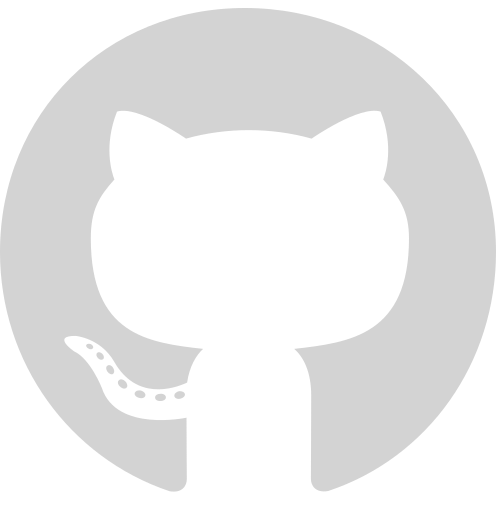

<!--  -->
<link rel="stylesheet" href="https://cdnjs.cloudflare.com/ajax/libs/font-awesome/6.0.0-beta3/css/all.min.css" integrity="sha512-Fo3rlrZj/k7ujTnHg4CGR2D7kSs0v4LLanw2qksYuRlEzO+tcaEPQogQ0KaoGN26/zrn20ImR1DfuLWnOo7aBA==" crossorigin="anonymous" referrerpolicy="no-referrer" />

# Hi there, 👋 my name is Mamunur Rashid Mamun

## I'm a Web Developer

I love and respect the work of myself and others. I always want to learn from every moment of life.

### Skills:

 
  
  
  
  
  
  
  
  
  
  
  

-   🔭 I’m currently working on full stack web development
-   🌱 I’m currently learning cross platform mobile app development
-   👯 I’m looking to collaborate on GitHub
-   💬 Ask me about front-end development
-   📫 How to reach me: Follow my contact information given below...

### Connect with me:

    

---

<!--      -->

<!--  -->

<!--  -->

<!--  -->

<!--  -->
